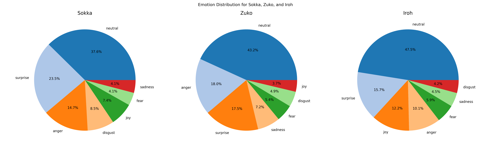

# SentimentBender - Emotional Dynamics Analysis of Avatar: The Last Airbender

## Overview
This project uses **Natural Language Processing (NLP)** and machine learning to analyze the emotional and sentiment dynamics of the top 10 characters in *Avatar: The Last Airbender*. Over 13,000 lines of dialogue were processed to uncover patterns in character development, emotional arcs, and sentiment trends across all three seasons.

## Objectives
- Identify the most common emotions expressed by main characters.
- Track emotional evolution in response to plot developments.
- Complement traditional qualitative analyses of the series with quantitative insights.

## Dataset
- Complete series transcript (13,369 lines).
- Each entry contains: Character, Episode, Script.
- Focused on the top 10 speaking characters; narrator lines excluded.

## Methodology
- **Data Cleaning:** Stage directions removed to prevent model bias.
- **Character Selection:** Top 10 speaking characters analyzed to manage resources.
- **Emotion Classification:** Using Hugging Face model `michellejieli/emotion_text_classifier`.
- **Analysis:** Emotion frequency, sentiment distribution, subjectivity scores.
- **Visualization:** 
  - Horizontal & vertical bar charts for top characters and emotion frequency.
  - Pie charts for emotion distribution overall and per book.
  - Grouped bar charts for average sentiment and subjectivity per season.
  - Stacked bar charts for subjectivity classes.
  - Word clouds for textual analysis.

## Key Findings
- Most common emotions: **joy, surprise, neutral, anger**.
- Overall sentiment is mostly neutral; when excluding neutral, positive sentiment dominates.
- Character-specific emotional arcs show distinct patterns across seasons.
### Examples:

- **Sokka:** Neutral(37.6%), surprise(23.5%), anger (14.7%).  
As shown in the pie chart above, Sokka’s top emotions reflect his portrayal as a witty strategist from the Southern Water Tribe who often fakes bravery but remains loyal and resourceful.  

- **Zuko:** Neutral(43.2%), anger(18.0%), surprise(17.5%).  
The pie chart illustrates Zuko’s emotional journey, dominated by anger and surprise, reflecting his struggle with his tyrannical father and quest to reclaim lost honor.  

- **Iroh:** Neutral (47.5%), joy(12.2%), surprise(15.7%).  
Iroh’s distribution in the pie chart highlights his calm, wise, and joyful nature, aligning with his role as a mentor and moral compass throughout the series.  

## Tools & Libraries
- **Python:** Pandas, NumPy, Matplotlib, Seaborn, NLTK, TextBlob, WordCloud, Transformers.

## Future Work
- Deep dive into subjectivity analysis per episode.
- Bigram analysis of dialogue patterns.
- Explore trends in sentiment and subjectivity across episodes and seasons.
